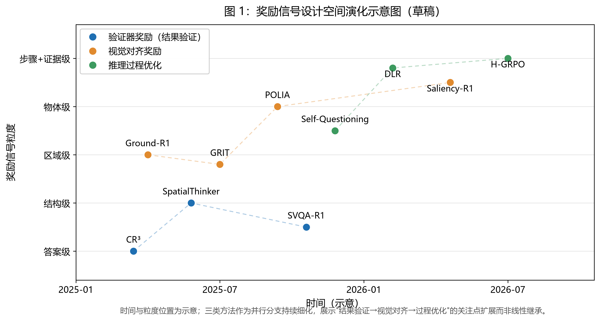

# 多模态大语言模型组合推理中的强化学习方法：奖励信号的演进（论文初稿·中文）

> 初稿进度：§1–§6 全部完成（2026-08-10）
> 写作策略：中文初稿 → 英文翻译；纯综述，无实验
> 依据：paper-outline.md（v2026-08-03）+ research-background.md + research-core-new.md + papers/ 论文概括
> 待办：摘要定稿 → 英文翻译 → 图 1 正式版精修（当前为草稿，见 figures/）

---

## 摘要

多模态大语言模型（Multimodal Large Language Models, MLLMs）在通用视觉-语言任务上表现优异，但在组合推理（compositional reasoning）——将物体、属性与空间/逻辑关系精确绑定起来进行理解的能力——上存在系统性缺陷，且该缺陷与模型规模无关。强化学习后训练成为弥补这一缺口的有效手段，而奖励信号的设计直接决定组合能力能否被真正激发。本文综述 2024–2026 年间用强化学习增强 MLLM 组合推理的代表性工作，提出以“奖励信号演进”为核心的分析框架：奖励信号正从对最终回答的结果验证，逐步演进为对视觉语义结构的对齐与对推理过程的对齐。这里的"演进"指奖励信号设计空间沿粒度维度的扩展与细化，三类方法并非优劣替代关系，至今仍并行发展：结果验证奖励保证回答的正确性，视觉对齐奖励保证结论的证据性，过程优化奖励保证推理的可解释性。据此将现有方法划分为验证器奖励、视觉对齐奖励与推理过程优化三类，并沿奖励来源、奖励粒度、监督需求、组合触及度等统一维度逐方法剖析。分析表明，组合推理“正确性必须可定义”的约束是奖励信号演进的深层驱动力，而面向组合绑定的显式视觉语义奖励是当前最有前景的研究缺口——尤其是将其从物体级扩展至属性-关系组合绑定。

**关键词**：多模态大语言模型；组合推理；强化学习；奖励信号；GRPO；后训练

---

## 1. Introduction

多模态大语言模型（Multimodal Large Language Models, MLLMs）在视觉问答、图像描述等通用视觉-语言任务上已展现出接近人类的能力，然而在组合推理（compositional reasoning）上仍存在系统性缺陷。所谓组合推理，是指模型将物体、属性、空间与逻辑关系精确绑定起来进行理解的能力：给定"左边的橙子发霉了，右边的橙子是新鲜的"这样一句描述，模型必须准确地把"左边"与"发霉"、把"右边"与"新鲜"绑定到正确的对象上，而不是凭借整体语义相似度蒙混过关。大规模评测揭示了这一缺陷的普遍性：CREPE 在 37 万级图文对上发现，无论模型架构与训练规模如何，组合理解都随组合复杂度增加而显著退化 [1]；ARO 指出视觉语言模型本质上像"词袋模型"，对词序与组合结构不敏感，甚至在不利用组合信息的情况下也能通过现有检索基准 [2]；SugarCrepe 进一步量化了失败模式的分布——模型在物体组合上接近人类水平，但在属性与关系组合上显著落后，其中纯绑定测试（Swap）最难 [3]。这些结果共同表明，组合推理缺陷是当前 MLLM 的系统性短板，而非个别模型的偶然现象。

组合缺陷的根源可以追溯到训练信号本身。ARO 的 shortcut 分析表明，现有对比预训练所优化的检索目标并不要求模型理解组合结构，模型仅凭词频与整体语义即可取得高分 [2]；CREPE 的证据进一步显示，组合性缺陷与模型规模无关，单纯扩大数据与参数无法自动习得组合能力 [1]。换言之，只要评测与训练不向组合正确性施加压力，模型就没有动机去精确绑定属性与关系。在此背景下，后训练阶段的强化学习（Reinforcement Learning, RL）成为弥补这一缺口的主流手段。与监督微调（SFT）直接灌输标准答案不同，RL 通过奖励信号让模型在试错中习得推理行为，因此奖励的定义方式直接决定训练方向。例如 CR³ 先把组合推理重新设计为答案可自动判分的任务，再以规则判定的二元奖励驱动 RL [4]；在多个组合基准上，其平均提升超过 9 个绝对点，且未出现 SFT 常见的领域外性能退化。由此，一个关键问题浮现：什么样的奖励信号才能真正驱动组合推理能力？

我们梳理 2024–2026 年间用 RL 增强 MLLM 组合推理的代表性工作后发现，其发展本质上是奖励信号从"结果验证"向"视觉语义结构对齐"与"推理过程对齐"的逐步扩展——此处"演进"特指奖励粒度的细化（答案级→结构级→过程级），而非方法间的优劣替代，三个方向至今仍并行发展：早期的奖励来自对最终回答的（结构化）结果验证（如 CR³、SpatialThinker、SVQA-R1），随后工作转向回答与视觉语义结构（区域、图、显著性）的对齐程度（如 Ground-R1、GRIT、POLIA），最新的方法则将优化信号作用于推理过程本身（如 Self-Questioning VLM、H-GRPO）。推动这一演进的深层驱动力，是组合推理"正确性必须可定义"这一约束：结果级奖励难以验证绑定是否正确，迫使研究者不断细化奖励信号，使其逼近组合结构本身。

本文以奖励信号演进为主线，对该领域进行系统性综述。具体贡献包括：(1) 首次以"奖励信号演进"为分析轴，将 RL 增强 MLLM 组合推理的方法组织为连续谱系，而非孤立方法的堆叠；(2) 提出三分法分类框架——验证器奖励、视觉对齐奖励、推理过程优化——并沿统一维度（奖励来源、监督需求、组合触及度、评测与局限）逐方法剖析；(3) 分析可验证性约束对奖励设计的制约，讨论基准碎片化、文本偏置等开放问题，并展望未来方向。

---

## 2. Background

### 2.1 组合推理的定义与评测基准

本文所称组合推理，指模型将视觉场景中的物体（object）、属性（attribute）与空间/逻辑关系（relation）精确绑定起来完成理解与推理的能力。它与"把问题分解为子问题"的推理范式不同：组合推理的核心不在于拆分，而在于绑定——"左边的橙子发霉了"要求模型同时正确识别物体（橙子）、属性（发霉、新鲜）及其空间位置（左/右），任何一处的绑定错误都会导致整体理解偏差。需要指出的是，这一区分针对的是推理目标而非推理手段：组合推理以绑定正确性为目标，而分解可以成为达成绑定的手段——后文 3.3 节的方法正是以显式分解为手段来逼近绑定目标，两者并不矛盾。由此，组合推理可操作化为三个子问题：属性绑定（attribute binding）、空间/逻辑关系（spatial/logical relation）与词序/结构敏感度（order/structure sensitivity）。

围绕上述能力，学界构建了一系列评测基准，其演进反映了对组合缺陷认识的深化。VALSE 是任务无关的语言现象基准，通过构造伪造实例（foiled instances）——对正确描述做最小修改使其与图像不符——测试模型对存在性、复数、计数、空间关系、动作与实体共指六类语言现象的判断，发现模型在空间关系与实体共指上表现挣扎 [5]。CREPE 将评测规模扩大至 37 万级图文对，从系统性与生产力两个认知维度考察组合性：系统性指理解"已知单元的新组合"的能力，生产力指理解"从未见过的单元组合"的能力；其结论是无论架构与规模，模型在组合主导的场景下检索性能一致下降 [1]。ARO 以 5 万级用例系统评测属性、关系与词序三类组合结构，提出"词袋模型"论断，并揭示评测 shortcut——现有检索基准不要求组合理解，模型可绕道得分 [2]。SugarCrepe 直接回应了 ARO 揭示的 shortcut 问题——此前程序化基准可被 hack，模型可绕道得分；它用 LLM 生成语义合理的困难负样本，将组合评测收敛为 Replace、Swap、Add 三类原子操作，并发现 Swap（交换两个同类别概念，不引入新概念）是最纯粹的绑定测试，也是所有模型表现最差的环节 [3]。

尽管各基准的评测协议不同，失败模式却高度一致：物体识别强于属性绑定，属性强于关系理解，而纯粹的绑定（Swap）最难。这为后续 RL 方法提供了明确的优化靶点。但值得注意的是，各方法在评测集选择上各行其是（VALSE、CREPE、ARO、SugarCrepe 乃至场景图基准并存），评测协议互不兼容，导致不同方法的结果难以直接横向比较——这一"基准碎片化"问题将在第 4 节讨论。表 1 汇总了上述基准的核心信息。

**表 1：组合推理评测基准对比**

| 基准 | 子任务维度 | 评测方式 | 规模 | 关键发现 |
|------|-----------|---------|------|---------|
| VALSE | 存在/复数/计数/空间关系/动作/共指 | 真假判断（foiled instances） | 851 例 | 空间关系、共指最弱 |
| CREPE | 系统性/生产力 | 检索（seen-unseen splits + 复杂度梯度） | 37 万级 | 缺陷与规模无关 |
| ARO | 属性/关系/词序 | 检索 | 5 万级 | 词袋模型；存在 shortcut |
| SugarCrepe | 物体/属性/关系 × Replace/Swap/Add | 二选一检索 | 7.5 千级 | Swap 最难；物体 > 属性 > 关系 |

### 2.2 RL 基础与奖励信号演进主线

将强化学习引入视觉-语言对齐的早期工作沿用了 LLM 的 RLHF 范式。LLaVA-RLHF 提出事实增强的 RLHF（Fact-RLHF），在训练奖励模型时注入图像描述等事实信息，以减少奖励篡改与幻觉 [6]；RLHF-V 将人类反馈细化为片段级纠错，用密集 DPO 学习标注员对具体输出片段的修正 [7]；Silkie 则用 GPT-4V 作为 AI 标注员生成偏好数据，代表 RLAIF 路线 [8]。此后多模态 DPO 家族（如 MM-RLHF [25]）把偏好对齐扩展到大规模多模态偏好数据，但反馈粒度仍停留在回答整体或片段，未触及组合绑定正确性。这些工作共同确立了"奖励来自对回答的评判"这一范式：无论反馈来自人类还是 AI，粒度都停留在回答整体或语言片段的好坏，尚未触及"组合绑定是否正确"。更关键的是，AI 反馈的可靠性受限于标注模型自身的组合能力——GPT-4V 在属性绑定与空间关系上同样存在系统性盲区，AI 反馈会传播同样的盲区。

数学推理领域的突破改变了奖励信号的设计方式。DeepSeekMath 提出的 GRPO [9] 去除了 PPO 的价值网络，对同一问题采样多个回答，用组内相对优势

$$ A_i = \frac{r_i - \bar{r}}{\sigma_r} $$

替代 critic 打分（实践中常在分母添加小常数 $\epsilon$ 以保证组内采样较少时数值稳定），配合确定性规则验证器（如数学答案比对）提供奖励，开辟了"可验证奖励强化学习"（RL with Verifiable Rewards, RLVR）路线。一个自然的对照是直接偏好优化（DPO）[24]：它以离线偏好对为原料、无需显式奖励模型，在可验证奖励设定下也可自动构造偏好对（同一问题采样多个回答、按规则判定正负）；但 DPO 的偏好对来自固定采样分布，不随策略迭代更新，难以从模型自生成的新推理路径中持续获益，实证上 DPO 在域内表现更强而 GRPO 在分布外泛化更好 [30]。GRPO 的在线组采样、组内相对优势以及与规则/结构化奖励的天然兼容性，是本文 3.1–3.3 各方法普遍以其为算法底座、并在此基础上扩展奖励粒度的深层原因。

进一步的理论分析表明，GRPO 与过程奖励模型（Process Reward Model, PRM）并非两条独立路线：在 token 级策略梯度与单次更新的设定下，标准 GRPO 目标与一个 PRM-aware 目标数学等价——组内多条回答的共享前缀天然定义了"过程步骤"，GRPO 一直在隐式地做过程级信用分配 [10]。多模态侧，VisualPRM 等工作也已将 PRM 扩展到多模态推理 [11]。

至此，奖励信号的可验证性来源经历了一次根本转变：从"人类/AI 模型的主观打分"走向"规则与结构的确定性验证"。然而组合推理不同于数学——它没有唯一的标准答案，正确性恰恰藏在属性与关系的绑定之中。如何为这种绑定定义可验证的奖励信号，正是第 3 节三类方法的出发点。

---

## 3. 方法分类

近年来，强化学习增强 MLLM 组合推理的方法并非沿单一路径发展，而是在奖励信号的可验证性与粒度两个维度上不断拓展。根据奖励信息来源，现有方法可以归纳为三类：结果验证奖励、视觉对齐奖励和推理过程奖励，分别对应组合推理中"是否正确"、"是否看对"与"是否合理推理"三个层面的优化目标。需要指出的是，类别之间体现的是奖励信号设计粒度的扩展——研究关注点逐渐从结果正确性扩展到视觉证据对齐与推理过程建模；这些方向并非严格的继承关系，而是不同研究团队针对"如何为组合推理定义有效奖励信号"这一共同问题形成的互补探索。本节按上述三类展开描述性梳理，每篇方法仍按统一维度（奖励来源、监督需求、组合触及度、评测与局限）呈现，类别间的关系集中于 3.4 节讨论。

### 3.1 验证器奖励（Verifier-based）

验证器奖励的整个家族建立在"正确性可定义"的前提上：当任务的答案可由规则、程序或结构约束自动判定时，验证器就能提供确定性的训练信号，无需训练奖励模型。组合推理恰好是这块前提的试验田——它的错误集中在精细绑定上，而绑定正误在一定任务设计下可以自动判定。围绕"验证什么"，不同工作探索了不同层级的验证对象：从最终答案，到推理的中间结构，再到回答的跨视角一致性。

**CR³** [4] 是结果级验证的代表：它的贡献不只是"用规则奖励做 RL"，更是把组合推理重新设计成答案可自动判分的任务。此前 MLLM 的组合推理增强依赖 SFT 或难负样本微调，效果有限且易过拟合；CR³ 构造三个图文匹配任务（TG-VCR、VG-TCR、CITM），回答正确与否由确定性规则判定，奖励为二元形式：
$$ r_{\text{task}}(a, a^*) = \mathbb{1}[\text{规则判定 } a \text{ 正确}], $$
无需任何外部标注。但规则判定只是前提，真正决定信号质量的是其数据工序：通过语义与视觉双重筛选构造高难度负样本（18.5 万→1.89 万，见表 3B），三个任务以模型自适应的动态比例混合，使二元奖励在"整体相似、细节绑定出错"的样本上保持梯度——若负样本太容易判别，奖励将在多数样本上失去信号，训练退化为对常见模式的拟合。Qwen2.5-VL-7B 与 InternVL3-8B 在三个组合基准上平均提升超 9 个绝对点，且无 SFT 常见的领域外退化（见表 3B）。其结果级验证不包含中间推理步骤的信息，而结构级验证提供了另一种选择。

与结果级验证不同，**SpatialThinker** [12] 探索了结构级奖励：验证对象扩展到推理的中间产物。它要求模型按固定模板输出"观察→场景图→推理→答案"，让场景图成为推理链中必须经过的结构；奖励由格式、计数、准确率、空间四个分量组成，经字典序门控保证优先级：
$$ R_{\text{total}} = \mathbb{1}[R_{\text{fmt}}=1]\left(w_f R_f + w_c R_c + w_a R_a + w_s R_s \cdot \mathbb{1}[R_a = 1]\right), $$
其中格式分量是硬门槛（格式不合规则整体归零），空间奖励仅在答案正确时生效——防止模型为了刷结构分而牺牲最终答案；四分量权重固定为 $w_f=0.1$、$w_c=0.2$、$w_a=0.5$、$w_s=0.2$，其中准确率权重最高，保证"先答对"优先。空间分量用匈牙利算法对预测与真实物体做二分图匹配，以 CIoU 与语义相似度为代价函数，对不重叠的框也提供稠密梯度。7B 模型在 14 个基准上平均超越 GPT-4o（+4.7%）；其代价是 STVQA-7K 基于 Visual Genome 人工标注构建，7,587 道题经双 LLM 交叉校验从 56,224 题中筛出，框标注的质量与密度直接决定空间分量的可靠性，这是该类方法落地的隐性门槛。

**SVQA-R1** [13] 则代表了对"跨视角一致性"的验证，验证器完全自监督。它将图像镜像翻转并用 GPT-4o 生成翻转后逻辑一致的问答对，要求模型对原图与翻转图给出语义一致的答案；奖励为格式与语义两个分量加权（$ r = \lambda_1 r^f + \lambda_2 r^s $），Spatial-GRPO 进一步比较原图组与翻转图组的语义奖励均值差 $\Delta$，对显著占优的一组施加 $ \eta\|\Delta\| $ 的扣分，迫使两组收敛。镜像翻转与语义编码均可自动完成，无需任何人工标注，3B 模型在 Q-Spatial++ 上较 SFT 基线提升超 30 个百分点；其验证范围限于水平镜像翻转下的空间问答。

**节内小结**：三篇工作共同构成结果验证方向下的不同探索——结构可判定的任务设计（CR³、SpatialThinker）与自监督的验证信号（SVQA-R1），验证对象覆盖答案、中间结构与跨视角一致性。它们的共同约束是"正确性必须可定义"：组合推理没有唯一标准答案，验证器只能验证可结构化的侧面。而组合绑定的关键性质在于——绑定是否正确，不在答案里，而在模型与视觉证据的关系中；对这一层面的优化，视觉对齐奖励提供了另一条独立路径（见 3.2）。

### 3.2 视觉对齐奖励（Grounded）

答对不等于看图：仅凭文本统计规律（文本偏置）或虚假相关，模型也能蒙对组合任务，而结果验证对此无能为力。视觉对齐奖励把信号源从"回答的外部判据"换成"回答与视觉证据的关系"，让"是否真的看了图、看了正确的区域"成为可优化信号。在该方向内部，不同工作沿"对齐对象"与"监督强度"两个维度展开探索：对齐对象从证据区域到思维链内嵌、再到物体级与显著性分布，监督强度则从少量问答对降到零标注。

**Ground-R1** [14] 是这一方向的起点，它证明了一件此前不确定的事：RL 下最轻量的格式监督就足以驱动模型学会定位证据。其两阶段 rollout 中，第一阶段（grounding rollout）模型输出证据框坐标，只给格式奖励，不要求框匹配任何标注；第二阶段（answer rollout）将证据框裁剪出的局部图像送回模型作答，奖励为格式与答案准确率之和；两阶段由同一 GRPO 目标联合优化，优势在全部 8 条轨迹上组内归一化。最有力的证据来自消融：加入 GT 框 IoU 奖励的变体与纯格式奖励几乎无差（82.0 vs 81.7），说明"框在哪里"本身不需要监督，答案信号会倒逼定位行为涌现——模型甚至学会在不确定时自动放大查看、迭代修正证据框。其机制可理解为：在共享的 GRPO 目标下，错误的定位会降低裁剪区域的答案正确率，进而压低对应轨迹的组内优势，定位行为与答案正确性因此在信用分配上被耦合——模型无需显式监督即可学到"看得准才答得对"。其对齐过程发生于"裁剪送回"环节，奖励区分答案对错与格式合规，但不对"看对地方"与"看得准不准"作进一步区分。

**GRIT** [15] 在监督强度上进一步压缩，并采用了对齐的另一种载体：包围框坐标直接内嵌进思维链（`<think>`→`<rethink>`→`<answer>`），让"思考"与"看图"在同一句话中完成，训练仅用 20 个图文问答三元组即触发基座模型的 grounded 推理能力。其消融还揭示了对齐信号须与推理需求挂钩：加入计数奖励后 grounding 质量显著提升（GIoU 0.387→0.349）。但 bbox 终究只是"看哪儿"的粗略代理，奖励仍不约束框本身的质量。

**POLIA** [16] 把对齐粒度细化到物体级，是本节中奖励公式最完整的设计。它把打分拆成两层：答案级外在优势 $A^{\text{ext}}$ 沿用 GRPO 的组内归一化；物体级内在优势 $A^{\text{int}}$ 先在答案引用的物体集合上按置信度修正奖励，再在引用同一物体集合的回答组内归一化：
$$ r_{i,o} = R(c_i) \cdot s_{i,o}, \qquad A^{\text{int}}_{i,o} = \frac{r_{i,o} - \text{mean}_{j \in G_S}[r_{j,o}]}{\text{std}_{j \in G_S}[r_{j,o}] + \delta}, \qquad A_i = A^{\text{ext}}_i + \omega A^{\text{int}}_i, $$
其中 $s_{i,o}$ 是预测框与真实物体匹配的置信度（IoU 与归一化距离加权）。看错地方的轨迹即使答对，其物体级优势也会被置信度压低，从而在奖励层面区分"答案对但看错地方"与"答案对且看对地方"。在 VSR 上 POLIA 将基线 GRPO 的 59.0% 提升至 81.3%，物体级打分仅占总训练时间的 0.0004%。**Saliency-R1** [17] 则把对齐对象从离散框推广为显著性分布本身，面向推理忠实度与可解释性；其评测以场景图关系任务为主，未显式覆盖组合基准，本文仅作补充引用。同方向的 SAYO [26] 以区域级视觉注意力作为奖励信号，直接对视觉关注行为做信用分配，把对齐对象从显式框进一步推广到注意力分布——这一谱系从离散证据框延伸到连续显著性/注意力分布，进一步印证了“回答-视觉证据对齐”信号的连续性。

**节内小结**：该方向的对齐对象覆盖证据区域、思维链内嵌、物体级与显著性分布，监督需求从 8K 问答对降到零标注。需要指出的是，上述工作多在通用 VQA 与空间问答上验证，显式组合基准（VALSE、SugarCrepe）上的覆盖仍然不足；此外，对齐奖励衡量"是否看对"，而组合推理还要求"是否合理推理"——后一问题由推理过程优化方向（3.3）专门处理。

### 3.3 推理过程优化（Process）

前两类的信号分别作用于"是否正确"与"是否看对"，第三类则把优化信号作用于推理过程本身：步骤级信用分配、分解结构与过程结构。理论上看，这类方法与结果验证存在深层联系——GRPO 在 token 级设定下与 PRM-aware 目标数学等价，组内共享前缀天然构成"过程步骤" [10]，即结果奖励本就在隐式地做过程级信用分配；本节方法可视为将这一隐式机制显式化、并在多模态设定下加以利用的探索。隐式 PRM 的共享前缀由答案正确性定义，不含视觉语义信息，这也是过程奖励设计需要面对的共同问题。将隐式机制显式化的第一步在多模态侧已经出现：VisualPRM [11] 以约 40 万条多模态过程监督数据（VisualPRM400K）训练 8B 过程奖励模型，用蒙特卡洛期望正确率自动标注步骤正误，推理时以 Best-of-N 选择回答，在 7 个多模态推理基准上为不同规模基座模型带来 3.7–8.9 个点的提升；但其步骤定义纯文本、无视觉锚定，不覆盖组合绑定。显式化的第二步，是把证据框等视觉结构锚定进步骤——这正是 H-GRPO 的探索。

**Self-Questioning VLM** [18] 是显式化的最小实现，设计刻意精简到只剩一个格式约束：模型必须按"子问题/子答案序列 + 最终答案"输出，奖励为二元形式：
$$ R(y, a^*) = \begin{cases} +1 & \text{if } \text{Format}(y) \land \text{Correct}(y, a^*), \\ -1 & \text{otherwise}, \end{cases} $$
子问题质量故意不检查。正是这种"不检查"逼出了分解行为：模型必须自己探索该问什么，A-OKVQA 从 46.8% 提升至 52.2%，且与标准 RLVR 对照模型的唯一差别就是格式要求，直接证明"过程结构约束"而非"答案奖励"是提升来源。其过程信号限于结构存在性：奖励不验证子问题内容，模型可能用无意义的问题应付格式。

**H-GRPO** [19] 则将过程奖励细化到步骤质量，并显式耦合视觉证据。它把推理结构化为"（子问题，子答案，证据框）"三元组序列 $\tau_i = \langle q_i, a_i, b_i \rangle$；预测与参考三元组经匈牙利二分图匹配，相似度矩阵综合证据框兼容性、子问题/子答案语义相似度与框 IoU 四个分量：
$$ S_{ij} = \frac{1}{4}\Big(E(\hat{b}_i, b_j^*) + \text{sim}_q(\hat{q}_i, q_j^*) + \text{sim}_a(\hat{a}_i, a_j^*) + \text{IoU}(\hat{b}_i, b_j^*)\Big), $$
其中 $E(\hat{b}_i, b_j^*)$ 衡量预测证据框存在且与参考证据区域兼容，$\text{sim}_q$ 与 $\text{sim}_a$ 为子问题与子答案的语义相似度（Sentence-BERT 余弦），IoU 为两框的空间重叠。总奖励为格式奖励与"答案奖励 × 匈牙利奖励"之和：
$$ \mathcal{R} = \alpha \mathcal{R}_{\text{fmt}} + \beta \mathcal{R}_{\text{ans}} \cdot \mathcal{R}_{\text{HS}}, $$
其中 $\alpha$、$\beta$ 控制格式奖励与答案-接地奖励的相对重要性（原文未公开具体取值），门控关系保证：光答对但中间步骤与证据 grounding 不到位，奖励即被门控。其奖励不仅检查过程格式，还要求步骤与参考链对齐、且每一步锚定证据框，从而抑制"忽略图像仅凭文本脑补"的捷径。值得注意其数学关系：GRPO 是 H-GRPO 对角匹配的特例，这在方法层面印证了"结果验证与过程验证同源"的结论。小模型受益最大（SmolVLM-2.2B 在 A-OKVQA 达 73.4%、OOD 基准 RoboSpatial 达 70.2%），但参考推理链的质量决定奖励上限，匈牙利匹配亦带来额外开销。**DLR** [20] 沿同一方向把"分解"本身作为可学习的推理行为（分解→看→推理），机制与自我提问同源，评测未显式覆盖组合推理，仅作补充引用。

**节内小结**：三篇工作的过程信号构造路径各异——从最简的格式约束，到结合参考链匹配与视觉证据的结构化奖励。过程信号多为模型自生成，监督需求是三类中最低的；但除 H-GRPO 的证据框约束外，过程信号普遍不含视觉语义结构——"过程"与"视觉"如何在奖励层面深度融合，仍是开放问题（详见第 4 节）。

### 3.4 三类方法对比分析

将三个方向放在一起看，可以得到本文对第 3 节的核心判断：三类方法并非离散类别，也不是彼此替代的技术路线，而是同一研究问题下的互补探索——它们共享"组合推理的正确性如何被奖励函数捕获"这一目标，分别从"是否正确"、"是否看对"、"是否合理推理"三个层面切入，构成奖励信号设计空间中的不同刻度。表 2 汇总类别层面的对比；表 3A 与表 3B 分别给出逐方法的奖励粒度刻度与实验设置。即便在方法层面，三个方向也存在互相借鉴：H-GRPO 的"答案奖励×匈牙利门控"融合了结果验证与过程匹配两种思想，POLIA 的物体级优势同样依赖答案级判据的引导——类别不是封闭的抽屉。至于方向间边界的渐进性与连续谱判断，属于分析层面而非描述层面，将在 4.1 节展开讨论。

**表 2：方法分类对比表**

| 维度 | 3.1 验证器奖励 | 3.2 视觉对齐奖励 | 3.3 推理过程优化 |
|------|---------------|-----------------|-----------------|
| 奖励信号来源 | 结果验证（规则/图结构/视图一致性） | 回答-视觉语义结构对齐度 | 过程结构/步骤信用分配 |
| 奖励粒度（典型刻度） | 答案级 → 结构/一致性级 | 区域级 → 物体级 → 显著性级 | 子问题级 → 步骤+证据级 |
| 是否触及组合绑定 | 间接（验证绑定结果） | 直接（绑定到视觉证据） | 间接（过程正确性） |
| 代表工作 | CR³ / SpatialThinker / SVQA-R1 | Ground-R1 / GRIT / POLIA / Saliency-R1 | Self-Questioning / H-GRPO / DLR |
| 主要短板 | 正确性难定义 | 评测未显式覆盖组合 | 过程信号多为纯文本 |

**表 3A：代表方法的设计对比**（奖励粒度、信号机制与监督需求；Saliency-R1、DLR 为补充引用，未列入）

| 方法 | 奖励粒度 | 信号机制 | 监督需求 |
|------|---------|---------|---------|
| CR³ | 答案级 | 二元规则验证器 | 无 |
| SpatialThinker | 场景图结构级 | 字典序门控多分量奖励 | 高（STVQA-7K 人工标注） |
| SVQA-R1 | 答案一致性级 | 跨视角一致性惩罚 | 无（自监督） |
| Ground-R1 | 证据区域级 | 两阶段格式+答案奖励 | 低（仅格式，无框标注） |
| GRIT | 区域级（思维链内嵌） | 格式+计数奖励 | 极低（20 个问答三元组） |
| POLIA | 物体级 | 置信度修正的物体级内在优势 | 低（利用数据集物体标注） |
| Self-Questioning | 子问题结构级 | 二元格式+正确性奖励 | 无 |
| H-GRPO | 推理步骤+证据级 | 匈牙利门控过程奖励 | 无 |

**表 3B：代表方法的实验设置与结果对比**（评测基准、关键数据/设计与代表性结果）

| 方法 | 评测基准 | 关键数据/设计 | 代表性结果 |
|------|---------|--------------|-----------|
| CR³ | MMVP/Winoground/Cola | 语义+视觉双重筛选：18.5 万→1.89 万难负样本 | 平均 +9 点 |
| SpatialThinker | 14 基准 | 匈牙利匹配 + CIoU 稠密梯度 | 平均 +4.7%（超 GPT-4o） |
| SVQA-R1 | Q-Spatial++ | 镜像翻转问答对 | 较 SFT +30 点（3B） |
| Ground-R1 | 通用 VQA 与空间问答 | GT-IoU 消融无增益（82.0 vs 81.7） | 定位行为自发涌现 |
| GRIT | 通用 VQA 与空间问答 | bbox 坐标内嵌思维链 | GIoU 0.387→0.349 |
| POLIA | VSR | 双层优势 A_ext + ωA_int | 59.0→81.3 |
| Self-Questioning | A-OKVQA | 子问题质量刻意不检查 | 46.8→52.2 |
| H-GRPO | A-OKVQA 与自建 OOD 基准 | 三元组序列（子问题/子答案/证据框）匹配 | SmolVLM-2.2B A-OKVQA 73.4% |

**图 1**：奖励信号设计空间演化示意图（草稿）——以时间为横轴、奖励粒度（答案级→结构级→区域级→物体级→步骤级）为纵轴，三类方法作为并行分支在不同时间点出现并持续细化，展示"结果验证→视觉对齐→过程优化"的关注点扩展而非线性继承；时间与粒度位置为示意，正式版将按各论文发表时间精修。

---

## 4. Discussion

### 4.1 奖励信号连续谱

3.4 节的三分法在描述上是方便的，但表 3A 的粒度刻度揭示了一个更本质的事实：三类方法并非离散的类别，而是同一奖励设计空间中的连续谱。三个方向的边界是渐进的：结果验证奖励依赖"正确性可定义"的外部判据，验证对象从答案扩展到结构与一致性；视觉对齐奖励将信号源替换为回答与视觉证据的关系，覆盖了结果验证无法触及的"看哪儿"层面；推理过程奖励则把推理结构本身纳入优化，监督需求总体最低。这一判断还有数学层面的支撑——在 token 级策略梯度与单次更新的设定下，标准 GRPO 的目标与 PRM-aware 目标等价，组内多条回答的共享前缀天然构成"过程步骤" [10]。换言之，结果奖励本就在隐式地做过程级信用分配，"结果验证"与"过程优化"的边界在算法层面是渐进的。方法层面同样呈现连续的混合形态：H-GRPO 的"答案奖励×匈牙利门控"同时包含结果验证与过程匹配两种信号，POLIA 的外在优势与内在优势同处一个损失函数，SVQA-R1 的一致性惩罚则介于验证器与自监督对齐之间；文本域亦有旁证，AtManRL [29] 把 token 级显著性作为奖励并入 GRPO，说明显著性/过程信号与结果信号的可组合性并非多模态特有。从后验视角看，所谓"演进"并不构成时间上的先后淘汰，而是粒度维度的刻度扩张：答案级（CR³）→结构级（SpatialThinker）→区域级（Ground-R1）→物体级（POLIA）→步骤级（H-GRPO），各刻度至今仍在并行发展。这一连续谱视角也提示，未来方法更可能沿谱系滑动、组合相邻刻度，而非开创离散的新类别。

### 4.2 组合正确性正变得可验证

本文 3.1 的验证器方法都建立在"正确性可定义"的前提上，而这一前提正被评测基准的构建方式不断加固。MM-CondChain [21] 展示了组合推理正确性程序化验证的完整范式：用可执行程序（VPIR）把多层组合条件构造出来并机械验证，再翻译成自然语言——"语言可能骗人，代码不会"。其 975 道题全部零人工标注、逻辑零矛盾、评分全可复现，并以 Path F1（整条条件链全部正确才得分）评测，最强模型也仅得 53.33，说明深度组合推理的可验证评测不仅是可能的，且当前模型远未饱和。但这一范式的边界同样清晰：程序化验证的是"逻辑层"——关系字符串与组合条件之间的一致性，而自然图像域的感知事实（"这个物体确实是红色"）仍依赖 MLLM 提取，无人工核对。这一依赖还带来规模效应问题：当 MLLM 自身的感知能力不足（如细粒度属性识别）时，提取出的"视觉事实"本身就带噪声，以它为输入的验证器只会放大噪声而非纠正它——可验证奖励或许只在感知能力已足够强的模型规模上才能充分发挥价值，这意味着"正确性可定义"的成立条件随模型规模而变化，而非方法学上的恒定前提。这恰好划定了可验证奖励的适用半径：当任务的正确性可分解为离散逻辑结构时，奖励可以完全规则化；当绑定依赖开放感知判断时，只能回到人工标注或自监督的近似（如 SVQA-R1 的跨视角一致性）。奖励设计的核心权衡，正在于把组合任务推进到逻辑可验证一侧的代价。

### 4.3 基准碎片化与 Swap 试金石

三类方法在评测上各行其是：CR³ 报告 MMVP、Winoground、Cola，SpatialThinker 横跨 14 个基准，SVQA-R1 聚焦 Q-Spatial++，Ground-R1 与 POLIA 主要在通用 VQA 与空间问答上验证，H-GRPO 则依赖 A-OKVQA 与自建 OOD 基准。表 1 的四个组合基准（VALSE、CREPE、ARO、SugarCrepe）协议各不相同——任务形式（检索/真假判断/二选一）、规模与指标均不兼容，任何两篇方法论文的结果都难以直接横向比较。碎片化的根因是组合能力难以单点测量；而现有共识恰好指向一个可作统一试金石的子任务：SugarCrepe 的 Swap——交换两个同类别概念而不引入新概念，是最纯粹的绑定测试，也是所有模型表现最差的环节 [3]。Swap 不依赖场景图标注、判别性强且与 RL 训练接口简单（规则可判定）。但 Swap 的构造方式在不同数据集中并不一致——SugarCrepe 的 Swap 采用固定的同类别概念交换规则，其他数据集未必如此——因此建议直接采用 SugarCrepe 官方 Swap 子集作为统一附加基准，后续工作在报告其他基准的同时一律附带该子集上的结果，使跨方法比较至少在一个维度上成立。

### 4.4 开放问题

三个开放问题贯穿全文。其一，文本偏置仍未根治：H-GRPO 的动机正是"忽略图像仅凭文本也能得分"的捷径 [19]，而结果验证方法（CR³、SpatialThinker）无法区分"真的看了图"与"恰好蒙对"；视觉对齐奖励虽触及此点，但其评测多在通用 VQA 上，显式组合基准的覆盖仍然不足。可对照的是，事实核查类奖励（如 Vera [27]、FactScore [28]）可以接入 RL 训练，但核查的是"声明—文本事实"而非"声明—图像证据"，只约束文本事实性，无法为组合绑定提供信号——文本偏置的根治仍须依赖视觉侧信号。其二，组合推理"无唯一答案"与"可验证奖励"存在结构性冲突：数学推理的标准答案可由规则比对，组合判断则往往语义开放，验证器只能验证可结构化的侧面，这一约束同时限制了三类方法的上限（3.1 小结）。其三，外部标注成本：SpatialThinker 依赖 7K 人工场景图标注，POLIA 需要数据集物体标注，Ground-R1 证明了无框监督的可行性，但代价是"看对地方"无法被直接验证——监督强度与信号保真度之间的权衡，尚无两全方案。

---

## 5. Future Directions

**分解式可验证奖励**。AlphaGRPO 提出的 DVReward 把复杂用户请求分解为原子化的可验证语义与质量子问题，再由通用 MLLM 逐项评估，为生成类任务提供稳定、可解释的反馈 [22]。需澄清的是，DVReward 面向图像生成等生成类任务，其"分解—逐项评估"的可验证逻辑与推理任务的正确性判定并不相同，本文借鉴的是其"分解—验证"框架本身，而非具体实现。这一思想对组合推理的直接启示是：将组合提示（如"左侧的红色物体在绿色的上面吗"）分解为可验证的子奖励（物体存在性、属性匹配、关系成立），使奖励沿组合结构逐项可判——当前 H-GRPO 的三元组匹配已具备雏形，但子奖励仍依赖参考链而非程序化判定；这一“分解—验证”思想在文本事实核查中已有先例（FactScore 的原子事实分解 [28]），将其迁移到视觉绑定子奖励是自然延伸。

**一致性奖励**。GRPO-CARE 指出标准 GRPO 在提升答案准确率的同时可能损害推理与答案的逻辑连贯性（一致性率仅 57.9%），并引入"答案正确性基础奖励 + 自适应一致性奖励"的两层设计，在 SEED-Bench-R1 上将一致性提升 24.5% [23]。将"推理连贯性"作为奖励维度，与本文 3.3 的过程优化方向同源，但以模型自对比而非外部参考链实现，监督成本更低，值得在组合推理设定下验证。

**统一奖励框架**。3.4 节显示三类信号已在方法层面互相渗透；下一步更系统的方向是显式加权融合——结果验证保证正确性、视觉对齐约束证据、过程信号塑造推理结构——并以多模态 PRM [11] 为统一载体。但需审慎的是，多模态 PRM 本身主要面向数学推理，其步骤粒度由文本推导定义，是否具备判断组合绑定正确性所需的感知与对齐能力尚待验证——若 PRM 无法可靠判断绑定正误，以其为基座的融合框架将失去根基；因此"将组合绑定纳入多模态 PRM 的步骤定义"本身是一个尚待验证的前提，而非现成的解决方案。

**评测协议标准化**。承接 4.3，向 Swap 式纯绑定测试收敛：统一 Swap 评测协议、共享训练/测试划分，使不同奖励设计在同一试金石上可比；MM-CondChain 的程序化验证范式亦可为标准化提供基础设施 [21]。

---

## 6. Conclusion

本文以奖励信号为主线，梳理了 2024–2026 年间用强化学习增强 MLLM 组合推理的代表性工作。后验地看，这些工作并未沿单一谱系线性推进，而是围绕"如何为组合推理定义有效奖励信号"这一共同问题，在粒度维度上形成了结果验证、视觉对齐与推理过程优化三类互补探索：验证器奖励将"正确性可定义"的任务转化为确定性信号，视觉对齐奖励把"是否看对"纳入优化目标，推理过程奖励则将步骤与证据结构显式化。三者共同构成奖励信号设计空间中的连续谱（答案级→结构级→区域级→物体级→步骤级），并在方法层面互相借鉴。推动这一空间不断扩展的深层驱动力，是组合推理“正确性必须可定义”的约束；而面向组合绑定的显式视觉语义奖励仍是当前最有前景、也最亟待填补的研究缺口——现有工作（POLIA）已把显式奖励推进到物体级，向属性-关系组合绑定的扩展尚未被系统探索。随着组合正确性评测走向程序化验证（MM-CondChain），奖励信号设计有望获得更坚实的地基——但感知事实的验证边界与基准碎片化问题，决定了这一扩展仍将是一个渐进而非跳跃的过程。

---

## 参考文献

[1] CREPE: Can Vision-Language Foundation Models Reason Compositionally? arXiv:2212.07796, CVPR 2023.
[2] When and Why Vision-Language Models Behave Like Bags-of-Words, and What to Do About It? arXiv:2210.01936, ICLR 2023.
[3] SugarCrepe: Fixing Hackable Benchmarks for Vision-Language Compositionality. arXiv:2306.14610, NeurIPS 2023.
[4] CR³: Boosting Compositional Reasoning in MLLMs through Rule-based Reinforcement Learning. AAAI 2026, doi:10.1609/aaai.v40i29.39680.
[5] VALSE: A Task-Independent Benchmark for Vision and Language Models Centered on Linguistic Phenomena. arXiv:2112.07566, ACL 2022.
[6] Aligning Large Multimodal Models with Factually Augmented RLHF (LLaVA-RLHF). arXiv:2309.14525.
[7] RLHF-V: Towards Trustworthy MLLMs via Behavior Alignment from Fine-grained Correctional Human Feedback. arXiv:2312.00849, CVPR 2024.
[8] Aligning Large Vision-Language Models with AI Feedback (Silkie). arXiv:2410.09421.
[9] DeepSeekMath: Pushing the Limits of Mathematical Reasoning in Open Language Models. arXiv:2402.03300.
[10] GRPO is Secretly a Process Reward Model. arXiv:2509.21154, 2025.
[11] VisualPRM: An Effective Process Reward Model for Multimodal Reasoning. arXiv:2503.10291, 2025.
[12] SpatialThinker: Reinforcing Scene Graph-Grounded Spatial Reasoning via Dense Rewards. arXiv:2511.07403, NeurIPS 2025.
[13] SVQA-R1: Reinforcing Spatial Reasoning in MLLMs via View-Consistent Reward Optimization. arXiv:2506.01371, ICLR 2026.
[14] Ground-R1: Incentivizing Grounded Visual Reasoning via Reinforcement Learning. arXiv:2505.20272, 2025.
[15] GRIT: Teaching MLLMs to Think with Images. arXiv:2505.15879, 2025.
[16] POLIA: Policy Optimization with Visual-Object-Level Intrinsic Advantage for Multimodal Reasoning. ICML 2026.
[17] Saliency-R1: Enforcing Interpretable and Faithful Vision-language Reasoning via Saliency-map Alignment Reward. arXiv:2604.04500, CVPR 2026.
[18] Self-Questioning Vision-Language Models: Reinforcement Learning for Compositional Visual Reasoning. arXiv:2606.15651, 2026.
[19] H-GRPO: Permutation-Invariant Reinforcement Learning for Grounded Visual Reasoning. arXiv:2606.29915, 2026.
[20] Decompose, Look, and Reason: Reinforced Latent Reasoning for VLMs. arXiv:2604.07518, 2026.
[21] MM-CondChain: A Programmatically Verified Benchmark for Visually Grounded Deep Compositional Reasoning. arXiv:2603.12266, 2026.
[22] AlphaGRPO: Unlocking Self-Reflective Multimodal Generation in UMMs via Decompositional Verifiable Reward. arXiv:2605.12495, ICML 2026.
[23] GRPO-CARE: Consistency-Aware Reinforcement Learning for Multimodal Reasoning. arXiv:2506.16141, 2025.
[24] Direct Preference Optimization: Your Language Model is Secretly a Reward Model. arXiv:2305.18290, NeurIPS 2023.
[25] MM-RLHF: The Next Step Forward in Multimodal LLM Alignment. arXiv:2502.10391, ICML 2025.
[26] Do MLLMs Really See It: Reinforcing Visual Attention in Multimodal LLMs (SAYO). arXiv:2602.08241, 2026.
[27] A General-Purpose Plausibility Estimation Model for Commonsense Statements (Vera). arXiv:2305.03695, EMNLP 2023.
[28] FActScore: Fine-grained Atomic Evaluation of Factual Precision in Long Form Text Generation. arXiv:2305.14251, EMNLP 2023.
[29] AtManRL: Towards Faithful Reasoning via Differentiable Attention Saliency. arXiv:2604.16158, ICLR 2026 Workshop.
[30] Delving into RL for Image Generation with CoT: A Study on DPO vs. GRPO. arXiv:2505.17017, 2025.
